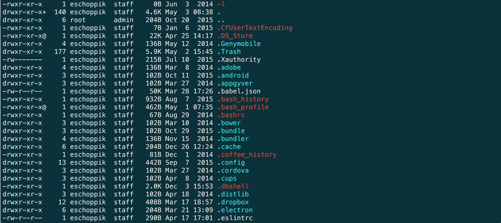

# Command Line Interface

## Learning Competencies

By the end of ths day you should be able to:

- Understand what `shell` and `bash` are
- Traverse filesystem, understand links & use them
- Learn redirection and use `>`, `>>` and `<`
- Understand piping via `head`, `tail` and `grep` 
- How to search for things in the Terminal?
- Write simple `shell` scripts with arguments
- Know Basics of Users and Permissions in the Terminal


## Overview

Developers do not always have pretty ways to interface or test their code. Most spend a good deal of time in their [command line](https://en.wikipedia.org/wiki/Command-line_interface) - "a tool where you can use text commands to perform specific tasks." When you use the command line, you don't slow yourself down opening a finder and double-clicking on folders. Instead, you get to navigate around your computer, open, create, delete, move, files, etc. all using commands. It's quick, efficient, and easy once you get the hang of it.

Knowing how to use your command line will be vital to your success as a programmer-- and it's the first place to start getting acclimated to this new way of using your computer.

Unfortunately (or fortunately), the command line is very simple. There are specific commands that will do certain things, so it's easy to learn how to do a lot via the command prompt which should save you some time using your mouse. That said, it's not incredibly fun since using it well requires rote memorization and constant practice.


### File system

Read about the [basic commands](https://tjhsst.edu/~dhyatt/superap/unixcmd.html)

Read Learning the Bash Shell [Chapter 1](https://www.safaribooksonline.com/library/view/learning-the-bash/0596009658/ch01.html).

As a warning, this reading is dense so don't expect yourself to understand every little bit of it. It's about getting some context on the shell in advance of using it. Take what you can from it.


### Links
Since we have files and folders located all over our file system, it becomes difficult to identify where many of these are located. Fortunately, we can create a link (also known as an alias) to a file or folder using the `l
` command. The structure looks like this:

`ln path_to_link name_of_link
`
There are two kinds of links we can make, hard and symbolic links - let's see how they work!

#### Hard Links
Let's create a file called `learn.txt` in our `Desktop` folder (type in `cd /Users/$USER/Desktop` if you need to get there). We can open up our `learn.txt` file using `open learn.txt` and let's add the text "Learning about links!".

Now let's create a link to this file! We can call our link `first_link`. To do this we use the ln command and type `ln learn.txt first_link`. Now if we cat `first_link` we should see the output "Learning about links!".

If we decide to move our `learn.txt` file anywhere we still have a link to it through `first_link`! Pretty awesome!

If we decided to delete our `learn.txt` file, what happens to our hard link? Let's `rm learn.txt` and then `cat first_link`. We still see that we have a link! This might seem strange; shouldn't a link be broken if a file is removed? Not with hard links! You can think of a hard link like a direct copy of a file. If the file is removed, the link still exists.

#### Symbolic Links
We saw that when we remove the original file, any hard links still remain and contain the entire source file. This is usually not what we want, since we usually want a reference to some file and not a direct copy. To create a reference instead of a copy, let's make a symbolic link.

To create a symbolic link, we use the -`s` flag when creating a link. Let's create a new file called `learn_again.txt` and then create a symbolic link using `ln -s learn_again.txt first_sym_link.` If we `cat first_sym_link` we do not get any errors! But if we delete or move `learn_again.txt`, our `first_sym_link` will be broken!

We can also use symbolic links for folders as well, which makes it very useful if we need to access a folder but do not remember the path. However, if your original file/folder path changes or is removed , the symbolic link **will** break!


### Redirection
Sometimes instead of simply displaying the output from a command to the terminal, it's useful to take the result output of a command and send it somewhere else. We call this "redirection" and it is denoted by `>>` or `>`. Let's start with a simple example using the `echo` command.

The `echo` command is useful for displaying text to the terminal, but many times it is more useful to take that text and redirect it to a file. In Terminal, type the command `echo Hello World > hello.txt`. Then, using the `cat` command, let's see what we just did by typing `cat hello.txt`. All we did here is take the text "Hello World" and instead of displaying it to the terminal, we sent it to a file called `hello.txt`!

Run the same command again but with slightly different text: `echo Hello Universe > hello.txt`. Now cat the file again. Notice that your new text completely overwrote the old text: you should see that "Hello World" has been replaced by "Hello Universe." In other words, when you use `>`, whatever text you're echoing into the file will completely overwrite any text that might already be in the file.

Maybe this is what you want, but maybe not. What if you're trying to append some text to the end of the file, rather than overwriting the text? In this case, use `>>` instead. Try it out: `echo Hello World >> hello.txt`. Now cat the file. You should see the following:

```shell
Hello Universe
Hello World
```
One very common use case for redirection is to put small pieces of text in a file. Instead of opening a text editor, typing in some text, saving it and closing the file we can do this all in one step.

#### Redirection with Input
So far we have seen redirection using `>` and `>>`. These arrows indicate redirection with standard output (take something and output it to something else). However, we can also use redirection with input as well using the `<` arrow. Let's use a command called `sort`, which sorts a file alphabetically. Imagine we have a file called `names.txt` with the following names:

```shell
Bob
Tom
Jim
Amy
```
If we want to sort this file, we can type sort names.txt and it will output

```shell
Amy
Bob
Jim
Tom
```
Now what if we want to take the contents of `names.txt`, redirect that to the `sort` command, and then send that output to a file called `sorted.txt`? The redirection will look like this: `sort < names.txt > sorted.txt`. This will now create a new file called `sorted.txt` with the names sorted alphabetically!

This might seem a bit strange, but try typing these commands and see what information you can output and redirect. As we see right now, we are only using the `sort` command, but what would happen if we wanted to use other commands along with sort? We would somehow need to connect each of these commands together. We connect these commands together through something called "pipes."


### [Piping](https://unix.stackexchange.com/questions/30759/whats-a-good-example-of-piping-commands-together)
At the end of the last chapter, we saw how we could use redirection to combine a couple of commands into one. In that case, in a single line we were able to both sort a text file and output the contents to a new file.

But what if we want to chain even more commands together? This is where piping comes into play. Before we learn about piping, though, let's learn/review a couple other terminal commands.

`head` - display the first lines of a file (using the `-n` flag we can specify the number of lines)

`tail` - display the last lines of a file (using the `-n` flag we can specify the number of lines)

`sort` - sort lines of a text file

`uniq` - removes duplicated lines (your data **must** be sorted for this to work)

`wc` - word, line, character and byte count

Now let's create two files - `first.txt` which contains the text

```shell
First
Second
Third
```
And `second.txt` which contains:

```shell
Fourth
Fifth
Sixth
```
If we want to concatenate (join) these two files together, we use the `cat` command:

`cat first.txt second.txt` (make sure the files and commands are separated by a space).

But what happens if we want to concatenate these two files and then find the word count? What if we want to concatenate and then sort it? This is where we need piping! You can think of a pipe as a connection between the output of one command into the input of another command. So once we concatenate two files we then want to send (or pipe) the result of that to another command. We can even combine this with redirection!

To pipe a command we use the `|` character. So if we want to pipe `cat` into `sort` it would look like this:

`cat first.txt second.txt | sort or cat first.txt second.txt | sort | head -n 2`

Take a look at this command and try to figure out what it's doing. You'll find a step-by-step answer below.

`cat first.txt second.txt | sort | tail -n 3 | head -n 1`

[Concatenate](https://encrypted.google.com/search?hl=en&q=concatnate) the two files first.txt and second.txt
Sort the results
Find the last 3 lines
Find the first line of those last 3 lines
This is how we can find the third from last line in a file (without knowing how many lines the file has).

#### `grep`
Let's examine another useful command called `grep` which is extremely powerful for finding text. On its own it is helpful, but it is quite useful when piped with `cat`. Let's try a simple example with `cat` f`irst.txt | grep First` - what do you see?

You should see the word `First` output to the terminal. This is because `grep` searched the file for the text `First` and found a match!

Notice that if `grep` doesn't find a match, it won't output anything. If it finds multiple matches, it will print them all. Try out these commands and see what `grep` returns to you!

```shell
cat first.txt second.txt | grep Nope
cat first.txt second.txt | grep th
```
Let's look at another example. Imagine you have a file called `petnames.txt`, and inside you have the following list of names:

```shell
Lassie
Moxie
Whiskey
Fido
Lassie
Moxie
```
We see here there are quite a few duplicates, so let's try to use the `uniq` command to remove these duplicate names. The problem is, when we run `uniq petnames.txt` we get the following

```shell
Lassie
Moxie
Whiskey
Fido
Lassie
Moxie
```
If we look back at our definition of how the `uniq` command works, we see that our data must be sorted! So how can we first use `sort` on `petnames.txt` then attach the `uniq` command? Piping to the rescue!

`sort petnames.txt | uniq` gives us

```shell
Fido
Lassie
Moxie
Whiskey
```
This looks great! But this text is just being output to the terminal, what if we want to output this text to a new file called `petnames_sorted.txt`? We can combine piping with redirection and use `sort petnames.txt | uniq > petnames_sorted.txt`. Now if we `cat petnames_sorted.txt` we should see our four unique sorted names!


#### `find`
One of the most useful terminal commands is the `find` command. When you know how to use it well, you can easily find files on your computer without using Spotlight, Alfred or any other GUI. Let's get started by learning how the syntax works.

To find a specific file in your current directory, you can simply type `find` and the name of the file. (If you try to find a folder you will find all of the contents inside as well.) For example, if try typing the following command from your home directory:

```shell
find Downloads
```
You should see a list of all your Downloads in the terminal.

To find something with a bit more complexity, use the following pattern

1. `find`
2. a filepath
3. an expression (this is where you have the most flexibility)
Let's `cd` into a folder called `views` and try this pattern to find anything with the name `first.txt` inside of the `views` folder:

`find . -name "first.txt"`

Now this is nice if we know exactly the name of the file we are looking for, but many times we need to use wildcard characters including `*`, `?` and `[]`. The difference between these characters is as follows:

`*` - any number of characters
`?` - one character
`[]` - any of the characters inside the brackets

Here are some more examples:

* Find inside of the `views` folder (assume we are inside the views folder) anything that ends with `.html` => `find . -name "*.html"`
* Find inside of the `views` folder (assume we are inside the views folder) anything that ends with a three letter file extension like `.txt` or `.css` => `find . -name "*.???"`
* Find inside of the `views` folder (assume we are inside the views folder) anything that starts with the letter `f` `t` or `s` => `find . -name "[fts]*"`
* Find inside of the `views` folder anything that has the text `main` somewhere in the filename (this could be the beginning as well) `find . -name "*main*"`


### Users and Permissions

When you're working in Terminal, you may sometimes find that you're not allowed to do things you want to do. Maybe you're trying to install something, or move a file from one directory to another, and you get an error telling you something along the lines of "permission denied." These sorts of permissions errors are extremely common, so understanding how to deal with them is important. That's what we'll learn how to in this chapter.

#### Users and Groups
Before you learn about permissions, you first need to understand users and groups. Let's take a look at an example. Head to your home directory and list everything using the `ls -lah` command. (Not sure what the `h` flag does? Check the manual!)

The output you get might look something like this:



The details of these files aren't important. What you should see is a bunch of rows of output, one row for each file or directory. Let's figure out what all of this actually means. For instance, here is the line for the `.bashrc` file from the above screen shot:

`-rwxr-xr-x 1 eschoppik staff 67B Aug 29 2014 .bashrc`

The third column specifies the username of the user that owns the file. In this case, `eschoppik` is the owner of the file. The fourth column specifies the name of the group associated with the file. In this case the group `staff` is associated with the file.


Here is how the above permissions string breaks down:


#### Changing permissions

You can read about `chmod` [here](https://en.wikipedia.org/wiki/Chmod).


#### Executable Files and Folders
Now let's talk a little bit more about what the `x` (executable) means for a file or a folder's permissions. If you have executable permissions on a folder, it means that you can cd into it. See what happens with the following commands:

```shell
mkdir test_folder
cd test_folder
cd ..
chmod 666 test_folder
cd test_folder
```
You should see an error saying permission denied. Add the execute permission back to the folder, and then remove the folder.

Now onto executable files. When a file is executable, it can be run from your shell as if it were a program. Let's first create our file. Type the following in your terminal:

```shell
echo ls > test.sh
echo pwd >> test.sh
echo pushd . >> test.sh
echo "cd ~" >> test.sh
echo "pwd" >> test.sh
echo popd >> test.sh
cat test.sh
```
The `test.sh` file should look like the following now:

```shell
s
pwd
pushd .
cd ~
pwd
popd
```
(Did you notice that our first `echo` command used a single arrow (`>`), while the other commands used two? We'll explore the difference between these two operators in the next chapter!)

Now let's make the file executable and run it. Use chmod to make it executable: `chmod 755 test.sh`. Next, execute the file by providing a path to the file. In our case, the file is in the current directory, so to execute it, we do the following: `./test.sh`. We just made our first executable shell script!


### Shell scripting

#### Wiki Says
A shell script is a computer program designed to be run by the Unix shell, a command-line interpreter. The various dialects of shell scripts are considered to be scripting languages.

#### Why to use it?
Here is an exerpt of an answer by *Jagdish Gedia* from [Quora](https://www.quora.com/What-is-the-use-of-shell-scripting)

Here are the few reasons why one should use shell scripting.

- You can write a script to initialize something at boot time of the system. so you don't need to do manually.
- You can write a script which installs per-requisite and build the code with user input to enable/disable some features.
- To kill or start multiple applications together.
- To observe large database of files and find some patterns out of it.
- So in general to automate the process and the list goes on....

So far we have learned how to use terminal commands, but our commands are not dynamic. We know exactly what the filenames are or what we might be searching for. Our commands are also not reusable easily; if the filename changes, we have to write the whole command again. To reduce duplication and perform far more sophisticated commands in the terminal, we can write shell scripts using a language called bash. To get started, let's create a file called `first.sh` and inside place the following

```shell
echo "Hello World"
```
Now if we try to run `./first.sh` it will tell us `permission denied: ./first.sh`. So we need to make this program executable! Let's change permissions to `755` so that anyone can run this file: `chmod 755 first.sh`. Now we can run `./first.sh`!

Let's make a second script called `second.sh`. Inside of this file, type the following:

```shell
echo Hello $1
```
What do you think that `$1` represents? Let's first `chmod 755 second.sh` and then run `./second.sh` - we should just see "Hello". Now let's try `./second.sh` World and we should see "Hello World"! What we just did was pass an argument to our script. Using arguments which start with `$1` and continue upward are how we can make more dynamic scripts.


## Exploration
- [Unix Permissions](http://www.grymoire.com/Unix/Permissions.html)
- What is [sudo](https://help.ubuntu.com/community/RootSudo)?
- What is `rm * -rf` ?
- [Regular Expressions](http://www.tldp.org/LDP/abs/html/x17129.html), [RegExp in JS](https://developer.mozilla.org/en-US/docs/Web/JavaScript/Guide/Regular_Expressions)
- Processes, [Killing Processes](http://superuser.com/questions/107543/bash-man-page-kill-pid-vs-kill-9-pid) & ([Daemons](https://en.wikipedia.org/wiki/Daemon_\(computing\)))
- Read about Secure Shell (SSH) [here](http://searchsecurity.techtarget.com/definition/Secure-Shell)
- Check this awesome tutorial on Shell Scripting [here](https://www.shellscript.sh/)
- Shell Scripting with Bash [Cheat Sheet](https://github.com/LeCoupa/awesome-cheatsheets/blob/master/languages/bash.sh)
- An interesting article **5 Cool Things You Can Do With an SSH Server** by *Chris Hoffman*. Read [here](https://www.howtogeek.com/114812/5-cool-things-you-can-do-with-an-ssh-server/)
- An article **A Beginner's Guide to Shell Scripting** by *Yatri Trivedi*. Read [here](https://www.howtogeek.com/67469/the-beginners-guide-to-shell-scripting-the-basics/)
- Unix vs linux !
- Remote Access via [SSH](https://linuxacademy.com/blog/linux/ssh-and-scp-howto-tips-tricks/)
